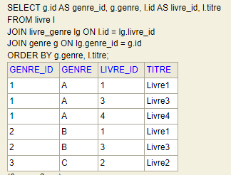
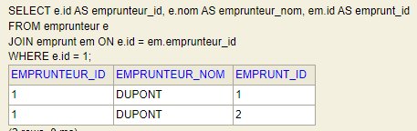
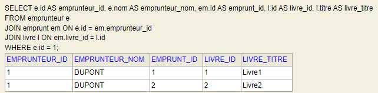
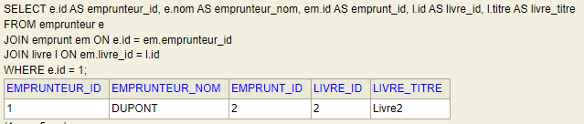
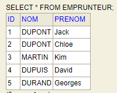
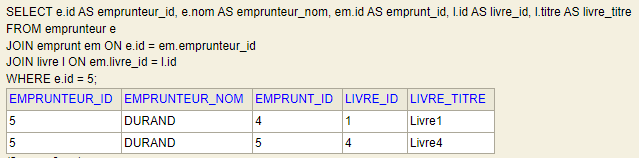
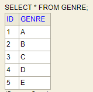

# Brief 15 - Création d'une application pour la gestion d'une bibliothèque
__________________________________________________________________________________  

## _Requêtes SQL:_

- Pour afficher tous les titres des livres regroupés par genre :

```
SELECT g.id AS genre_id, g.genre, l.id AS livre_id, l.titre  
FROM livre l  
JOIN livre_genre lg ON l.id = lg.livre_id  
JOIN genre g ON lg.genre_id = g.id  
ORDER BY g.genre, l.titre;
```

- Pour afficher les emprunts de l'emprunteur avec l'ID 1
  
```
  SELECT e.id AS emprunteur_id, e.nom AS emprunteur_nom, em.id AS emprunt_id
  FROM emprunteur e
  JOIN emprunt em ON e.id = em.emprunteur_id
  WHERE e.id = 1;
  ```
- Pour afficher les titres des livres empruntés par l'emprunteur avec l'ID 1

```
SELECT e.id AS emprunteur_id, e.nom AS emprunteur_nom, em.id AS emprunt_id, l.id AS livre_id, l.titre AS livre_titre
FROM emprunteur e
JOIN emprunt em ON e.id = em.emprunteur_id
JOIN livre l ON em.livre_id = l.id
WHERE e.id = 1;
```

## _Gestion de la bibliothèque:_
- Suppression de l'emprunt du livre avec l'id 1, pour l'emprunteur 1  
  ```
  DELETE FROM emprunt
  WHERE emprunteur_id = 1 AND livre_id = 1;
  ```  
  
  
- Ajout d'un emprunteur :
  ```
  INSERT INTO emprunteur (nom, prenom)
  VALUES ('DURAND', 'Georges');
  ```  
  
- Enregistrement des emprunts réalisé par l'emprunteur 5:
  ```
  INSERT INTO emprunt(EMPRUNTEUR_ID, LIVRE_ID)
  VALUES (5,1),
  (5,4);
  ```  


- Ajout des nouveaux genres de livre:
```
INSERT INTO genre (genre)
VALUES ('D'),
('E');
```
